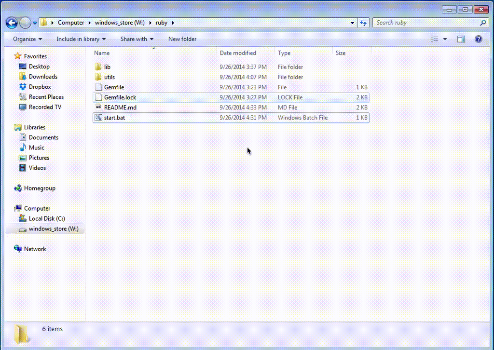

This is just a portable ruby runtime environment for windows  with a bunch of utilities and gems to run a cucumber test suite

### How to

- Clone Repo
- Run Start.bat by double clicking

### What's inside?

- ruby 2.1.3p242 (2014-09-19 revision 47630) [x64-mingw32]
- DevKit-mingw64-64-4.7.2-20130224-1432-sfx.exe
- Console2
- Unix Utilities
- Chromedriver
- IEDriver

### Installed Gems
- bigdecimal (1.2.4)
- builder (3.2.2)
- bundler (1.7.3)
- childprocess (0.5.3)
- chronic (0.10.2)
- cucumber (1.3.17)
- diff-lcs (1.2.5)
- ffi (1.9.5 x64-mingw32)
- gherkin (2.12.2)
- headless (1.0.2)
- io-console (0.4.2)
- json (1.8.1)
- mini_portile (0.6.0)
- minitest (4.7.5)
- multi_json (1.10.1)
- multi_test (0.1.1)
- nokogiri (1.6.3.1 x64-mingw32)
- psych (2.0.5)
- rake (10.3.2, 10.1.0)
- rdoc (4.1.0)
- rubyzip (1.1.6)
- selenium-webdriver (2.43.0)
- syntax (1.2.0)
- test-unit (2.1.3.0)
- watir-webdriver (0.6.11)
- watir-webdriver-performance (0.2.4)
- websocket (1.2.1)

### Known Issues
If ansicon is not installed successfully, please run

`ansicon -i`

